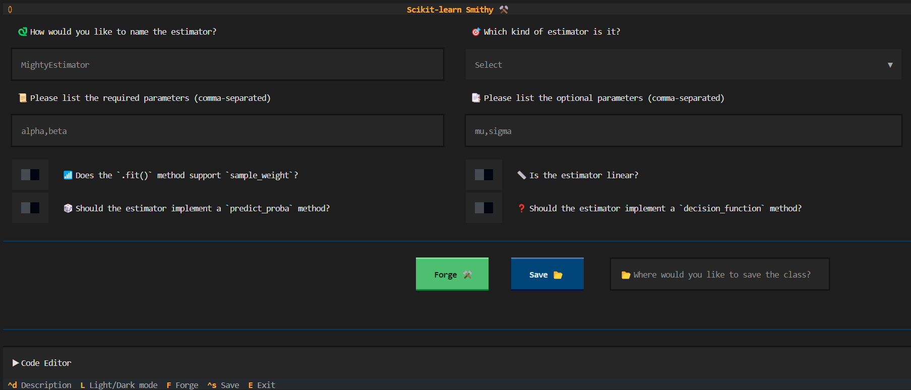

# User Guide 📚

As introduced in the [home page](index.md), **sklearn-smithy** is a tool that helps you to forge scikit-learn compatible estimator with ease, and it comes in three flavours.

Let's see how to use each one of them.

## Web UI 🌐

TL;DR:

- [x] Available at [sklearn-smithy.streamlit.app](https://sklearn-smithy.streamlit.app/){:target="_blank"}
- [x] It requires no installation.
- [x] Powered by [streamlit](https://streamlit.io/){:target="_blank"}

The web UI is the most user-friendly, low barrier way, to interact with the tool by accessing it directly from your browser, without any installation required.

Once the estimator is forged, you can download the script with the code as a `.py` file, or you can copy the code directly from the browser.

??? example "Screenshot"
    

## CLI ⌨️

TL;DR:

- [x] Available via the `smith forge` command.
- [x] It requires [installation](installation.md): `python -m pip install sklearn-smithy`
- [x] Powered by [typer](https://typer.tiangolo.com/).

Once the library is installed, the `smith` CLI (Command Line Interface) will be available and that is the primary way to interact with the `smithy` package.

The CLI provides a main command called `forge`, which will prompt a series of question in the terminal, based on which it will generate the code for the estimator.

!!! warning "Non-interactive mode"
    As for any CLI, in principle it would be possible to run it in a non-interactive way, however this is not *fully* supported yet and it comes with some risks and limitations.

    The reason for this is that the validation and the parameters interaction happen while prompting the questions *one after the other*, meaning that the input to one prompt will determine what follows next.

### `smith forge` example

Let's see an example of how to use `smith forge` command:

<div class="termy">

```console
$ <font color="#4E9A06">smith</font> forge
# 🐍 How would you like to name the estimator?:$ MightyClassifier
# 🎯 Which kind of estimator is it? (classifier, outlier, regressor, transformer, cluster, feature-selector):$ classifier
# 📜 Please list the required parameters (comma-separated) []:$ alpha,beta
# 📑 Please list the optional parameters (comma-separated) []:$ mu,sigma
# 📶 Does the `.fit()` method support `sample_weight`? [y/N]:$ y
# 📏 Is the estimator linear? [y/N]:$ N
# 🎲 Should the estimator implement a `predict_proba` method? [y/N]:$ N
# ❓ Should the estimator implement a `decision_function` method? [y/N]:$ y
# 🧪 We are almost there... Is there any tag you want to add? (comma-separated) []:$ binary_only,non_deterministic
# 📂 Where would you like to save the class? [mightyclassifier.py]:$ path/to/file.py
<span style="color: green; font-weight: bold;">Template forged at path/to/file.py </span>
```

</div>

Now the estimator template to be filled will be available at the specified path `path/to/file.py`.

<div class="termy">

```console
$ cat path/to/file.py
import numpy as np

from sklearn.base import BaseEstimator, ClassifierMixin
from sklearn.utils import check_X_y
from sklearn.utils.validation import check_is_fitted, check_array
...
```

</div>

## TUI 💻

TL;DR:

- [x] Available via the `smith-tui` command.
- [x] It requires installing [extra dependencies](installation.md#extra-dependencies): `python -m pip install "sklearn-smithy[textual]"`
- [x] Powered by [textual](https://textual.textualize.io/).

If you like the CLI, but prefer a more interactive and graphical way from the comfort of your terminal, you can use the TUI (Terminal User Interface) provided by the `smith-tui` command.

??? example "Screenshot"

    ```console
    $ smith-tui
    ```
    
    
